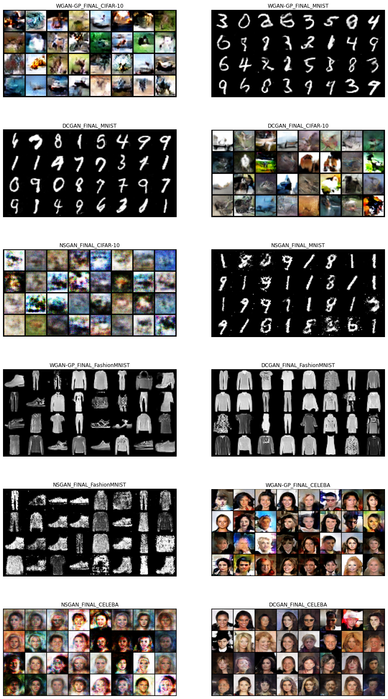
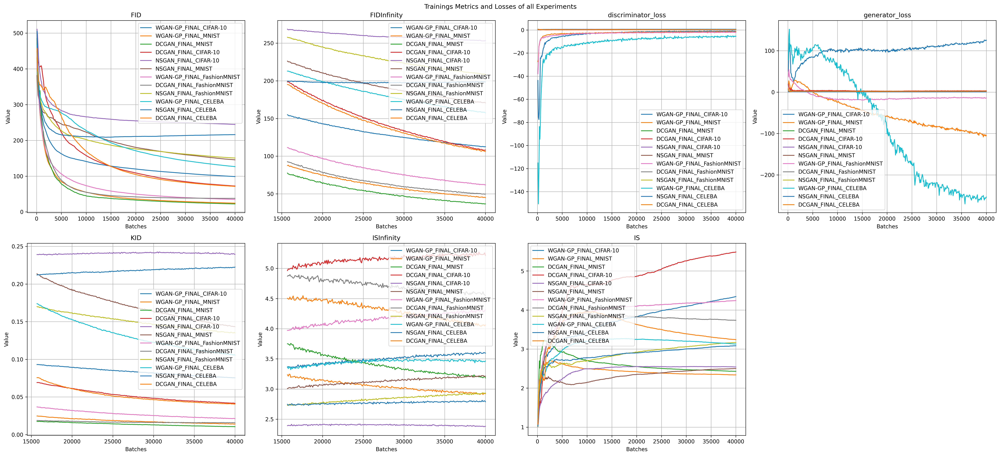
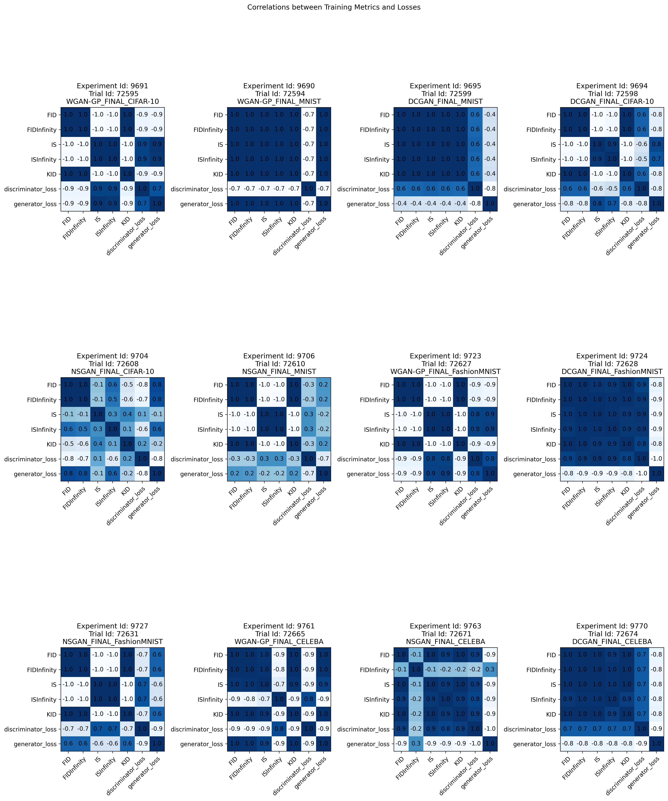
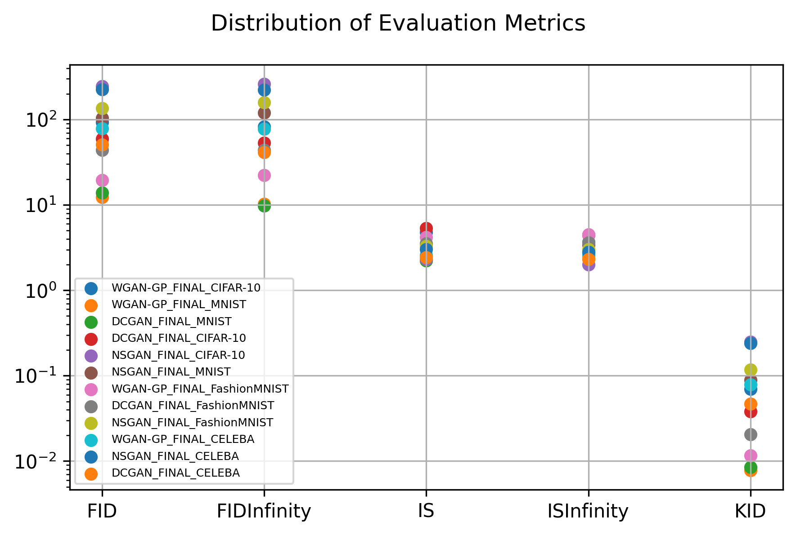
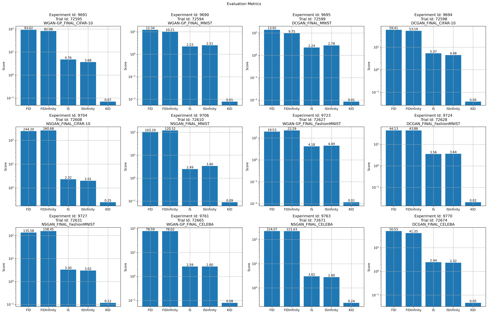
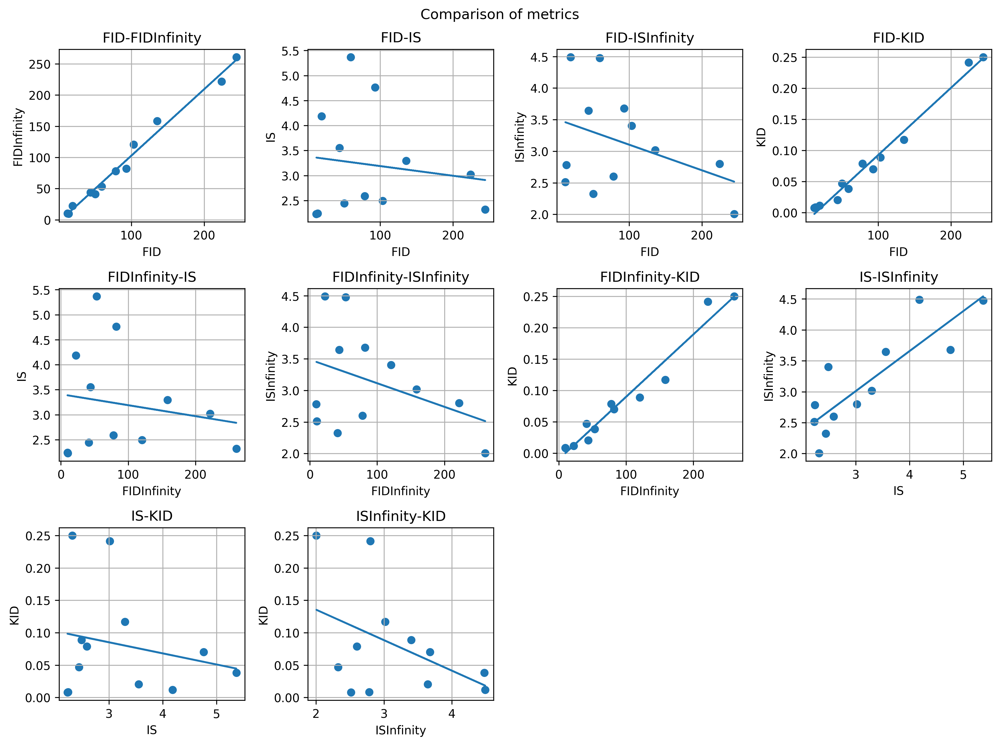
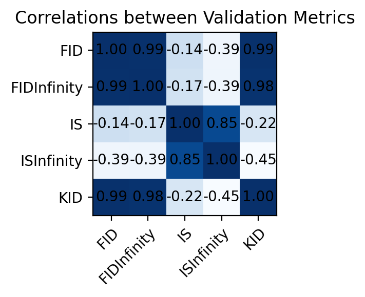

```python
import requests
import json
import numpy as np
import matplotlib as mpl
mpl.rc('image', cmap='Blues')
import matplotlib.pyplot as plt
import torch
from torchvision.utils import make_grid
from itertools import combinations
from tqdm import tqdm
import pandas as pd
import paramiko
from paramiko import SSHClient
from scp import SCPClient
import os
from numpy.polynomial.polynomial import polyfit
from scipy.stats import t as t_dist
%matplotlib inline
```

### List of Experiments


```python
WGAN_GP_CIFAR = 9691
WGAN_GP_MNIST = 9690
DCGAN_MNIST = 9695
DCGAN_CIFAR = 9694
NSGAN_CIFAR = 9704
NSGAN_MNIST = 9706
WGAN_GP_FASHIONMNIST = 9723
DCGAN_FASHIONMNIST = 9724
NSGAN_FASHIONMNIST = 9727
WGAN_GP_CELEBA = 9761
NSGAN_CELEBA = 9763
DCGAN_CELEBA = 9770

# Grouped by GAN-Architecture
NSGAN_ALL_DATASETS = [NSGAN_MNIST, NSGAN_FASHIONMNIST, NSGAN_CIFAR, NSGAN_CELEBA]
WGAN_GP_ALL_DATASETS = [WGAN_GP_MNIST, WGAN_GP_FASHIONMNIST, WGAN_GP_CIFAR, WGAN_GP_CELEBA]
DCGAN_ALL_DATASETS = [DCGAN_MNIST, DCGAN_FASHIONMNIST, DCGAN_CIFAR, DCGAN_CELEBA]

# Grouped by Dataset
MNIST_ALL_GANS = [NSGAN_MNIST, DCGAN_MNIST, WGAN_GP_MNIST]
FASHIONMNIST_ALL_GANS = [NSGAN_FASHIONMNIST, DCGAN_FASHIONMNIST, WGAN_GP_FASHIONMNIST]
CIFAR_ALL_GANS = [NSGAN_CIFAR, DCGAN_CIFAR, WGAN_GP_CIFAR]
CELEBA_ALL_GANS = [NSGAN_CELEBA, DCGAN_CELEBA, WGAN_GP_CELEBA]

ALL_EXPERIMENTS = [9691, 9690, 9695, 9694, 9704, 9706, 9723, 9724, 9727, 9761, 9763, 9770]
```

### Settings


```python
EXPERIMENT_IDS = ALL_EXPERIMENTS
USERNAME = 'ldrews'
PASSWORD = ''
BASE_URL = 'https://dt1.f4.htw-berlin.de:8443'
# Für den Download der Bilder von diesem Server muss eine Verbindung zum internen Hochschulnetz bestehen
IMAGES_URL = 'avocado01.f4.htw-berlin.de'
```

### API URLs


```python
login_url = '/api/v1/auth/login'
logout_url = '/api/v1/auth/logout'
get_trialId = lambda experimentId: f'/api/v1/experiments/{experimentId}/trials'
get_trial_url = lambda trialId: f'/api/v1/trials/{trialId}'
get_experiment_url = lambda experimentId: f'/api/v1/experiments/{experimentId}'
get_trials_of_experiment_url = lambda experimentId: f'/api/v1/experiments/{experimentId}/trials'
```

### Helper functions and classes


```python
class Experiment:
    description: str
    labels: list
    name: str
    dataset: str
    experiment_id: int
    trials: list
    hyperparameters: list
    def __init__(self, experiment_id, description=None, labels=[], name=None, dataset=None, hyperparameters=None):
        self.experiment_id = experiment_id
        self.description = description
        self.labels = labels
        self.name = name
        self.dataset = dataset
        self.trials = []
        self.hyperparameters = hyperparameters
        
    def __str__(self):
        return f'Experiment Id: {self.experiment_id}, name: {self.name}'
```


```python
class Trial:
    trial_id: int
    training_metrics: list
    training_metric_labels: list
    validation_metrics: list
    number_of_batches: int
    def __init__(self, trial_id, number_of_batches, training_metrics=None, validation_metrics=None, training_metric_labels=None):
        self.trial_id = trial_id
        self.training_metrics = training_metrics
        self.validation_metrics = validation_metrics
        self.training_metric_labels = training_metric_labels
        self.number_of_batches = number_of_batches
    
    def __str__(self):
        return f'Trial Id: {self.trial_id}'
```


```python
class Metric:
    name: str
    steps: list
    data: list
    def __init__(self, name, steps, data):
        self.name = name
        self.steps = steps
        self.data = data
        
    def __str__(self):
        return f'Metric {self.name}'
```


```python
def load_and_display_images(paths, figsize=(16, 10)):
    imgs = []
    for name, p in paths:
        try:
            img = torch.load(p, map_location=torch.device('cpu')).detach()
            img = make_grid(img[0:32])
            img = img.permute(1, 2, 0)
            imgs.append((name, img))
        except FileNotFoundError:
            print(f'Couldn\'t load images from path {p}')
           
        
    if len(imgs) > 0:
        fig = plt.figure(figsize=figsize)
        columns = 2
        rows = calculate_number_of_rows(len(imgs), 2)
        for i, (name, e) in enumerate(imgs):
            ax = fig.add_subplot(rows, columns, i+1)
            ax.set_title(f'{name}')
            plt.axis('off')
            plt.imshow(e)
```


```python
def download_file(url, username, password, path, experiment_id, file_name, local_path='.'):
    try:
        with SSHClient() as ssh:
            ssh.load_system_host_keys()
            ssh.set_missing_host_key_policy(paramiko.AutoAddPolicy())
            ssh.connect(url, username=username, password=password)

            with SCPClient(ssh.get_transport()) as scp:
                scp.get(f'{path}/{file_name}', local_path=local_path)
    except TimeoutError:
        print(f'Couldn\'t connect to url {url}')
```


```python
def download_images(experiment_id, file_name, local_path='.', rename=False, new_name=None):
    path = f'/data/determined/shared_fs/imgs/experiment{experiment_id:0>5}/'
    download_file(url=IMAGES_URL, username=USERNAME, password=PASSWORD,
                         path=path, experiment_id=experiment_id, file_name=file_name, local_path=local_path)
    
    os.makedirs(local_path, exist_ok=True)
    if rename and new_name is not None:
        if local_path[-1] != '/':
            local_path = local_path + '/'
        try:
            os.rename(f'{local_path}{file_name}', new_name)
        except FileExistsError:
            print(f'File {new_name} does already exist')
```


```python
def calculate_number_of_rows(number_of_plots, number_of_cols):
    if number_of_plots % number_of_cols == 0:
        return number_of_plots // number_of_cols
    else: 
        return number_of_plots // number_of_cols + 1
```

### Determined AI Authentification


```python
# Authenticate 
login_body = json.dumps({
    'username': f'{USERNAME}', 
    'password': f'{PASSWORD}'
    }).encode('utf-8')

login_headers = {
    'Content-Type': 'application/json',
    'accept': 'application/json',
}

response = requests.post(url=f'{BASE_URL}{login_url}', data=login_body, headers=login_headers)
if response.status_code == 200:
    print('authenticated')
    authenticated = True
    data = response.json()
    
    authenticated_headers = {
    'Content-Type': 'application/json',
    'accept': 'application/json',
    'Authorization': f'Bearer {data["token"]}',
    }
```

    authenticated
    


```python
def get_experiment_data(experiment_id):
    with requests.get(
        url=f'{BASE_URL}{get_experiment_url(experiment_id)}',
        headers=authenticated_headers) as response:
        if response.status_code == 200:
            data = response.json()
            description = data['experiment']['description']
            labels = data['experiment']['labels']
            name = data['experiment']['name']
            dataset = None
            try:
                dataset = data['config']['data']['dataset']
            except KeyError:
                print("Couldn't find dataset in config")
            hyperparameters = data['config']['hyperparameters']
            hyperparameters = {x[0]: x[1]['val'] for x in hyperparameters.items()}
            return Experiment(experiment_id, description=description, labels=labels, name=name, dataset=dataset, hyperparameters=hyperparameters)
```


```python
def get_trial_ids_of_experiment(experiment_id):
    with requests.get(
    url=f'{BASE_URL}{get_trials_of_experiment_url(experiment_id)}',
    headers=authenticated_headers) as response:
        if response.status_code == 200:
            data = response.json()
            trial_ids = [trial['id'] for trial in data['trials']]
            return trial_ids
```


```python
def get_trial_data(trial_id):
    with requests.get(
    url=f'{BASE_URL}{get_trial_url(trial_id)}',
    headers=authenticated_headers) as response:
        if response.status_code == 200:
            data = response.json()
            validation_metrics = data['trial']['bestValidation']['metrics']

            training_steps = [step['training'] for step in data['workloads'] if 'training' in step]
            training_metrics_data = [(x['totalBatches'], x['metrics']) for x in training_steps]
            training_metric_labels = list(training_metrics_data[0][1].keys())
            number_of_batches = max([x[0] for x in training_metrics_data])
            #print(training_metrics_data)
            
            training_metrics = dict()
            batch_steps, data = zip(*training_metrics_data)
            
            for l in training_metric_labels:
                metric_data = [x[l] for x in data]
                training_metrics[l] = Metric(name=l, steps=batch_steps, data=metric_data)
                
            return Trial(trial_id, 
                         number_of_batches=number_of_batches,
                         training_metrics=training_metrics, 
                         validation_metrics=validation_metrics, 
                         training_metric_labels=training_metric_labels)
```

### Get data of all experiments


```python
experiments = []
```


```python
if authenticated:
    for exp_id in tqdm(EXPERIMENT_IDS):
        experiment = get_experiment_data(exp_id)
        if experiment is not None:
            experiments.append(experiment)
    
    for exp in tqdm(experiments):
        trial_ids = get_trial_ids_of_experiment(exp.experiment_id)
        for trial_id in trial_ids:
            trial = get_trial_data(trial_id)
            if trial is not None:
                exp.trials.append(trial)
```

    100%|███████████████████████████████████████████████████████████████████████████████████████████████████████████████████████████████████████████████████████████████████████████████████████| 12/12 [00:00<00:00, 14.23it/s]
    100%|███████████████████████████████████████████████████████████████████████████████████████████████████████████████████████████████████████████████████████████████████████████████████████| 12/12 [00:52<00:00,  4.34s/it]
    

## Overview


```python
names = []
datasets = []
descriptions = []
hyperparameter_names = set()
hyperparameters = []

for e in experiments:
    names.append(e.name)
    datasets.append(e.dataset if e.dataset is not None else '')
    descriptions.append(e.description)
    for n in e.hyperparameters.keys():
        hyperparameter_names.add(n)
        
for e in experiments:
    hp = []
    for n in hyperparameter_names:
        hp.append(e.hyperparameters[n] if n in e.hyperparameters.keys() else '')
    hyperparameters.append(hp)

data = list(zip(datasets, hyperparameters))
data = list(map(lambda x: [x[0], *x[1]], data))
df = pd.DataFrame(data, columns=['dataset', *hyperparameter_names])
df.index = names
df = df.reindex(sorted(df.columns), axis=1)
df
```


<div>
<style scoped>
    .dataframe tbody tr th:only-of-type {
        vertical-align: middle;
    }

    .dataframe tbody tr th {
        vertical-align: top;
    }

    .dataframe thead th {
        text-align: right;
    }
</style>
<table border="1" class="dataframe">
  <thead>
    <tr style="text-align: right;">
      <th></th>
      <th>b1</th>
      <th>b2</th>
      <th>critic_iterations</th>
      <th>dataset</th>
      <th>disc_iterations</th>
      <th>evaluate_while_trainig</th>
      <th>global_batch_size</th>
      <th>gradient_penalty</th>
      <th>gradient_penaty_lambda</th>
      <th>latent_dim</th>
      <th>lr</th>
    </tr>
  </thead>
  <tbody>
    <tr>
      <th>WGAN-GP_FINAL_CIFAR-10</th>
      <td>0.5</td>
      <td>0.900</td>
      <td>5</td>
      <td>cifar-10</td>
      <td></td>
      <td>True</td>
      <td>32</td>
      <td>True</td>
      <td>10</td>
      <td>100</td>
      <td>0.0002</td>
    </tr>
    <tr>
      <th>WGAN-GP_FINAL_MNIST</th>
      <td>0.5</td>
      <td>0.900</td>
      <td>5</td>
      <td>mnist</td>
      <td></td>
      <td>True</td>
      <td>32</td>
      <td>True</td>
      <td>10</td>
      <td>100</td>
      <td>0.0002</td>
    </tr>
    <tr>
      <th>DCGAN_FINAL_MNIST</th>
      <td>0.5</td>
      <td>0.999</td>
      <td></td>
      <td>mnist</td>
      <td>1</td>
      <td>True</td>
      <td>32</td>
      <td></td>
      <td></td>
      <td>100</td>
      <td>0.0002</td>
    </tr>
    <tr>
      <th>DCGAN_FINAL_CIFAR-10</th>
      <td>0.5</td>
      <td>0.999</td>
      <td></td>
      <td>cifar-10</td>
      <td>1</td>
      <td>True</td>
      <td>32</td>
      <td></td>
      <td></td>
      <td>100</td>
      <td>0.0002</td>
    </tr>
    <tr>
      <th>NSGAN_FINAL_CIFAR-10</th>
      <td>0.5</td>
      <td>0.999</td>
      <td></td>
      <td>cifar-10</td>
      <td>1</td>
      <td>True</td>
      <td>32</td>
      <td></td>
      <td></td>
      <td>100</td>
      <td>0.0002</td>
    </tr>
    <tr>
      <th>NSGAN_FINAL_MNIST</th>
      <td>0.5</td>
      <td>0.999</td>
      <td></td>
      <td>mnist</td>
      <td>1</td>
      <td>True</td>
      <td>32</td>
      <td></td>
      <td></td>
      <td>100</td>
      <td>0.0002</td>
    </tr>
    <tr>
      <th>WGAN-GP_FINAL_FashionMNIST</th>
      <td>0.5</td>
      <td>0.900</td>
      <td>5</td>
      <td>fashion-mnist</td>
      <td></td>
      <td>True</td>
      <td>32</td>
      <td>True</td>
      <td>10</td>
      <td>100</td>
      <td>0.0002</td>
    </tr>
    <tr>
      <th>DCGAN_FINAL_FashionMNIST</th>
      <td>0.5</td>
      <td>0.999</td>
      <td></td>
      <td>fashion-mnist</td>
      <td>1</td>
      <td>True</td>
      <td>32</td>
      <td></td>
      <td></td>
      <td>100</td>
      <td>0.0002</td>
    </tr>
    <tr>
      <th>NSGAN_FINAL_FashionMNIST</th>
      <td>0.5</td>
      <td>0.999</td>
      <td></td>
      <td>fashion-mnist</td>
      <td>1</td>
      <td>True</td>
      <td>32</td>
      <td></td>
      <td></td>
      <td>100</td>
      <td>0.0002</td>
    </tr>
    <tr>
      <th>WGAN-GP_FINAL_CELEBA</th>
      <td>0.5</td>
      <td>0.900</td>
      <td>5</td>
      <td>celeba</td>
      <td></td>
      <td>True</td>
      <td>32</td>
      <td>True</td>
      <td>10</td>
      <td>100</td>
      <td>0.0002</td>
    </tr>
    <tr>
      <th>NSGAN_FINAL_CELEBA</th>
      <td>0.5</td>
      <td>0.999</td>
      <td></td>
      <td>celeba</td>
      <td>1</td>
      <td>True</td>
      <td>32</td>
      <td></td>
      <td></td>
      <td>100</td>
      <td>0.0002</td>
    </tr>
    <tr>
      <th>DCGAN_FINAL_CELEBA</th>
      <td>0.5</td>
      <td>0.999</td>
      <td></td>
      <td>celeba</td>
      <td>1</td>
      <td>True</td>
      <td>32</td>
      <td></td>
      <td></td>
      <td>100</td>
      <td>0.0002</td>
    </tr>
  </tbody>
</table>
</div>


### Plot sample images


```python
for e in experiments:
    download_images(e.experiment_id, 'fake.pt', local_path='/imgs/', rename=True, new_name=f'{e.experiment_id}.pt')
```


```python
load_and_display_images([(e.name, f'{e.experiment_id}.pt') for e in experiments], figsize=(16, 30))
```


    

    


## Training

### Plot Training Metrics


```python
number_of_batches = 0
loss_labels = set()

for e in experiments:
    for t in e.trials:
        number_of_batches = max(number_of_batches, t.number_of_batches)
        for l in t.training_metric_labels:
            loss_labels.add(l)


number_of_plots = len(loss_labels)

number_of_cols = 4
if number_of_plots > 5:
    number_of_rows = calculate_number_of_rows(number_of_plots, number_of_cols)
else:
    number_of_rows = 5

    
    
fig = plt.figure(dpi=300)
fig.suptitle(f'Trainings Metrics and Losses of all Experiments')#, fontsize=200)#, y=1.005)
fig.set_size_inches(26, 12)
index = 1


for l in loss_labels:
    ax = fig.add_subplot(number_of_rows, number_of_cols, index)
    for e in experiments:
        for t in e.trials:
            if l in t.training_metrics.keys():
                ax.plot(t.training_metrics[l].steps, t.training_metrics[l].data, label=f'{e.name}')
    ax.grid(True)
    ax.legend()
    ax.set(xlabel='Batches', ylabel='Value', title=f'{l}')
    #ax.set_ylim([y_min, y_max])
    index = index + 1
fig.tight_layout()
```


    

    


### Create a scatterplot for every combination between metrics (and losses)


```python
'''
number_of_plots = 100

number_of_cols = 4
if number_of_plots > 5:
    number_of_rows = calculate_number_of_rows(number_of_plots, number_of_cols)
else:
    number_of_rows = 5
    
for e in experiments:
    fig = plt.figure(dpi=300)
    fig.suptitle(f'Trainings Metrics and Losses of {e.name}', fontsize=200, y=1.005)
    index = 1
    for t in e.trials:
        for x, y in combinations(t.training_metric_labels, 2):
            ax = fig.add_subplot(number_of_rows, number_of_cols, index)
            ax.scatter(t.training_metrics[x].data, t.training_metrics[y].data)
            ax.set(xlabel=x, ylabel=y, title=f'{x}-{y}')
            ax.grid(True)
            index = index + 1
    fig.set_size_inches(60, 200)
    fig.tight_layout()
''';
```

### Correlations between Training Metrics


```python
number_of_plots = sum([len(e.trials) for e in experiments])
    
number_of_cols = 4
if number_of_plots > 5:
    number_of_rows = calculate_number_of_rows(number_of_plots, number_of_cols)
else:
    number_of_rows = 5


index = 1
fig = plt.figure(dpi=300)
fig.set_size_inches(16, 20)
#16/20

for e in experiments:
    for t in e.trials:
        metrics = t.training_metrics
        labels = t.training_metric_labels
        
        data = np.array([metric.data for metric in metrics.values()])
        try:
            start_indices = [np.where(d == None)[0] for d in data]
            start_index = np.amax([i[-1] for i in start_indices if len(i) > 0]) + 1
        except:
            start_index = 0

        data = np.corrcoef(np.vstack([metric.data[start_index:] for metric in metrics.values()]))
        #print(data)
        ax = fig.add_subplot(number_of_rows, number_of_cols, index)
        im = ax.imshow(data)
        ax.set_xticks(np.arange(len(labels)))
        ax.set_yticks(np.arange(len(labels)))
        ax.set_xticklabels(labels)
        ax.set_yticklabels(labels)

        # Loop over data dimensions and create text annotations.
        for i in range(len(labels)):
            for j in range(len(labels)):
                text = ax.text(j, i, "{:.1f}".format(data[i, j]), ha="center", va="center", color="black")


        ax.set_title(f'Experiment Id: {e.experiment_id}\n Trial Id: {t.trial_id}\n{e.name}')
        index = index + 1
        plt.setp(ax.get_xticklabels(), rotation=45, ha="right", rotation_mode="anchor")
fig.suptitle(f'Correlations between Training Metrics and Losses', y=1.0025)
fig.tight_layout()
```


    

    


## Evaluation

### Scatter Plot


```python
fig = plt.figure(dpi=300)
fig.set_size_inches(6, 4)
index = 1

ax = fig.add_subplot(1, 1, index)
fig.suptitle('Distribution of Evaluation Metrics')
for e in experiments:
    for t in e.trials:
        labels = list(t.validation_metrics.keys())
        values = list(t.validation_metrics.values())
        ax.scatter(labels, values, label=e.name)
        ax.grid(True)
        ax.legend(prop={'size': 6})
        ax.set_yscale('log')
fig.tight_layout()
```


    

    


### Metrics grouped by experiment


```python
fig = plt.figure(dpi=300)
fig.set_size_inches(22, 14)
index = 1


for e in experiments:
    for t in e.trials:
        labels = list(t.validation_metrics.keys())
        values = list(t.validation_metrics.values())
        ind = np.arange(len(t.validation_metrics))
        ax = fig.add_subplot(number_of_rows, number_of_cols, index)
        bars = ax.bar(ind, values)
        ax.set_ylabel('Score')
        ax.set_title(f'Experiment Id: {e.experiment_id}\n Trial Id: {t.trial_id}\n{e.name}')
        ax.set_xticks(ind)
        ax.set_xticklabels(labels)
        ax.bar_label(bars, fmt='%.2f')
        ax.grid(True)
        ax.set_yscale('log')
        index = index + 1   
        
fig.suptitle('Evaluation Metrics', y=1.0025)
fig.tight_layout()
```


    

    


### Scatterplot of Correlations


```python
labels = set()
data = dict()

for e in experiments:
    for t in e.trials:
        for l in t.validation_metrics.keys():
            labels.add(l)

            
for e in experiments:
    for t in e.trials:
        for l in t.validation_metrics.keys():
            if l not in data.keys():
                data[l] = list()
            data[l].append(t.validation_metrics[l])


number_of_plots = len(list(combinations(data, 2)))

number_of_cols = 4
if number_of_plots > 5:
    number_of_rows = calculate_number_of_rows(number_of_plots, number_of_cols)
else:
    number_of_rows = 5
    
    
fig = plt.figure(dpi=300)
fig.suptitle(f'Comparison of metrics')
index = 1
for x, y in combinations(data, 2):
    b, m = polyfit(data[x], data[y], 1)
    ax = fig.add_subplot(number_of_rows, number_of_cols, index)
    ax.scatter(data[x], data[y])
    ax.plot(data[x], b + m * np.array(data[x]), '-')
    ax.set(xlabel=x, ylabel=y, title=f'{x}-{y}')
    ax.grid(True)
    index = index + 1

fig.set_size_inches(12, 9)
fig.tight_layout()
```


    

    


### Correlation in Heatmap


```python
labels = set()
data = dict()

for e in experiments:
    for t in e.trials:
        for l in t.validation_metrics.keys():
            labels.add(l)

            
for e in experiments:
    for t in e.trials:
        for l in t.validation_metrics.keys():
            if l not in data.keys():
                data[l] = list()
            data[l].append(t.validation_metrics[l])


corrs = np.corrcoef(np.vstack(list(data.values())))


fig, ax = plt.subplots(dpi=200)
fig.set_size_inches(3, 3)
im = ax.imshow(corrs)
ax.set_xticks(np.arange(len(data.keys())))
ax.set_yticks(np.arange(len(data.keys())))

ax.set_xticklabels(data.keys())
ax.set_yticklabels(data.keys())

# Loop over data dimensions and create text annotations.
for i in range(len(data.keys())):
    for j in range(len(data.keys())):
        text = ax.text(j, i, "{:.2f}".format(corrs[i, j]),
                       ha="center", va="center", color="black")
        
ax.set_title("Correlations between Validation Metrics")
plt.setp(ax.get_xticklabels(), rotation=45, ha="right", rotation_mode="anchor")
fig.tight_layout()      
```


    

    


```python
def t_test(r, n):
    return (r * np.sqrt(n - 2)) / (np.sqrt(1 - r * r))
```


```python
def calculate_p_value(test_value, dof):
    return 2*(1 - t_dist.cdf(abs(test_value), dof))
```


```python
calculate_p_value(t_test(r=-0.22, n=12), dof=10)
```


    0.49204531484512315


```python

```
